# Лабораторная 1. Умножение матриц
Выполнила: Файзиева Юлия, M34331

Цель работы: Реализовать эффективную программу, выполняющую умножение матриц с использованием OpenCL (версия 1.2).

Конфигурация ноутбука:

CPU: 12th Gen Intel i7-12700H 45W (20) 
Total Cores 14, Performance-cores 6, Efficient-cores 8, Total Threads 20      
IGPU: Intel® Iris® Xe Graphics (96EU)        
DGPU: NVIDIA GeForce RTX 3050 Mobile, 4 GB GDDR6
Memory: 32 GB, DDR5

Конфигурация сервера:
CPU: 6th Gen Intel i5-6400 
Total Cores 4, Total Threads 4      
IGPU: Intel® UHD Graphics 630        
DGPU: AMD Radeon 5700XT, 8 GB GDDR6
Memory: 8 GB, DDR4

## Реализация 0
Стандартное перемножение матриц на одном потоке процессора, содержит 3 вложенных цикла. Храним матрицы как одномерные массивы, чтобы они лежали как непрерывный кусок в памяти. Асимпотика $O(nmk)$, 1 поток.

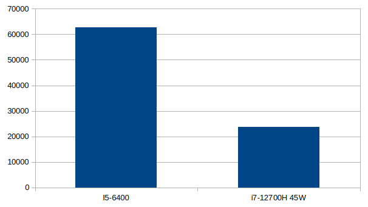
Время работы(в мс) идет на секунды на обоих процессорах.

## Реализация 1 
Реализация с использованием OpenCL: создали n * m work item'ов и использовали только глобальную память. Каждый work item совершает $O(k)$ операций подсчета, в конце записывает в соответствующую ячейку матрицы. Прирост скорости связан с тем, что work item'ы за счет высокого параллелизма work item'ов. 
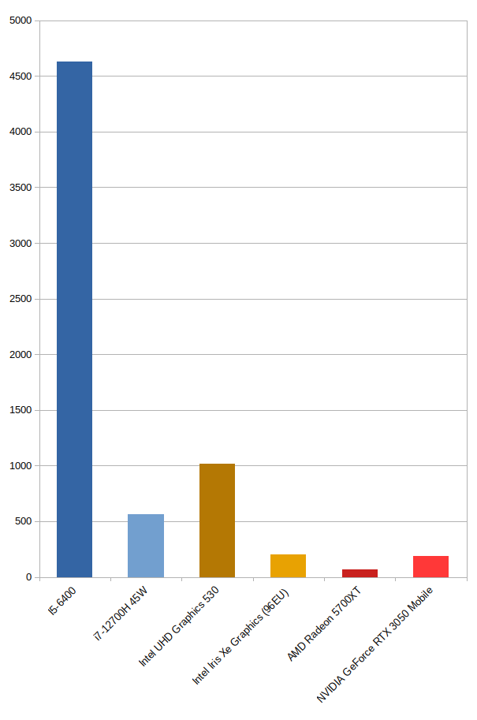
Сравнение времени на разных девайсах в мс.

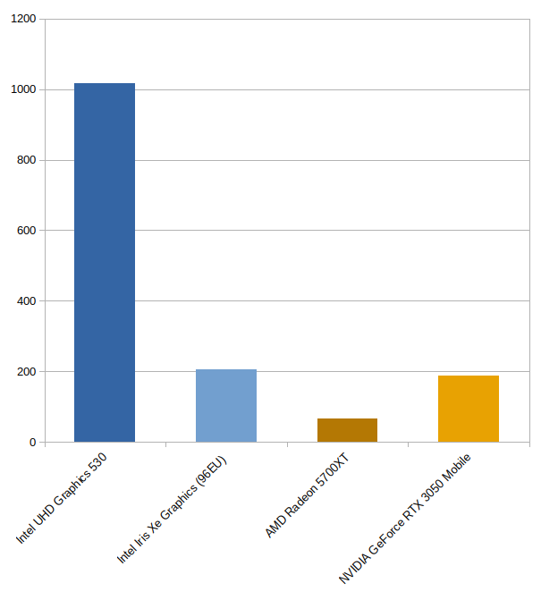
Также еще 1 график без процессоров для большей наглядности 
## Реализация 2
В этой реализации использовали локальную память: ее сильно меньше, чем глобальной, но доступ к ней осуществляется значительно быстрее. 2 матрицы(первый и второй множители соответственно) последовательно загружали в квадратные блоки локальной памяти из глобальной. По стандартну должно выполняться global_work_size % local_work_size == 0: для этого на хосте округлили глобальные размерности вверх и выделили новые матрицы calloc'ом, по свойствам умножения матриц лишние элементы не повлияли на правильность ответа.

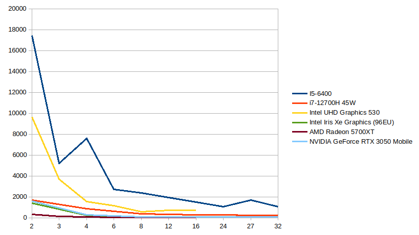
Все устройства, ось X: размер локальной группы, ось Y: время в мс

Измерили время на всех девайсах: в общем случае прослеживается закономерность, что скорость и размер локальной группы прямо пропорциональны. Ограничения на графиках(по оси X) обусловлены тем, что упираемся в лимит локальной памяти/лимит размера локальной группы на устройстве. 

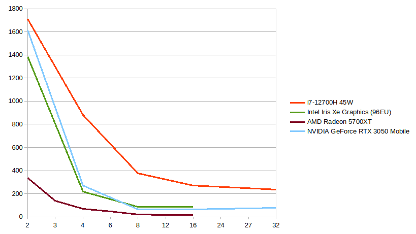

Более быстрее устройства(для наглядности), ось X: размер локальной группы, ось Y: время в мс

Также был рассмотрены случаи с немного расширенными блоками локальной памяти(для 2ой реализации +1 к размеру локальной группы TILE_SIZE), так как часто замедляющим фактором в доступах к памяти являются банк-конфликты. Таким образом, чтение в соседних строках будет из различных банков памяти благодаря расширению.

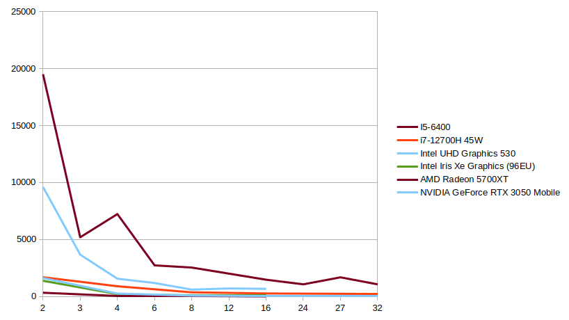

Все устройства, расширение для матрицы A, ось X: размер локальной группы, ось Y: время в мс

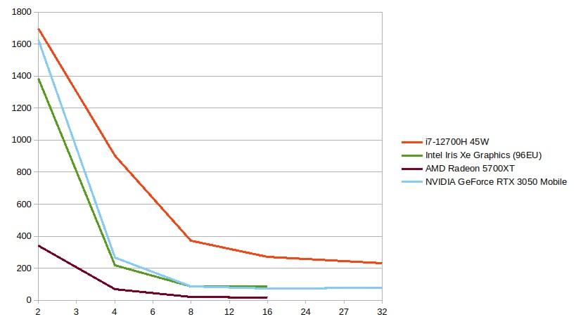

Более быстрые устройства, расширение для матрицы A, ось X: размер локальной группы, ось Y: время в мс

Сравнения на одном и тоем же устройстве, но с разными вариантами расширений(в том числе без):

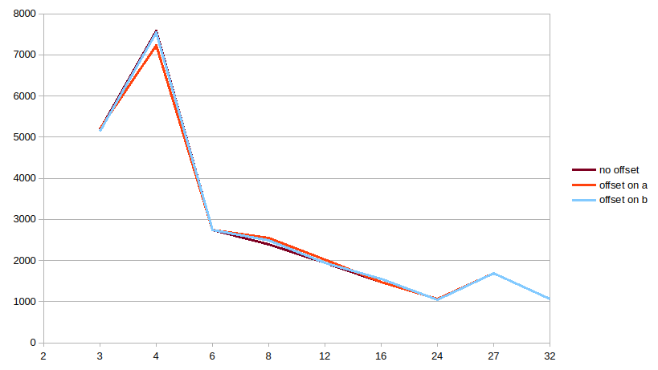

CPU: Intel i5-6400

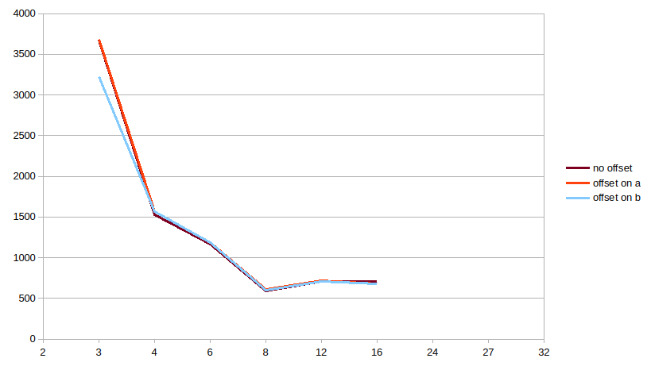

IGPU: Intel UHD Graphics 530

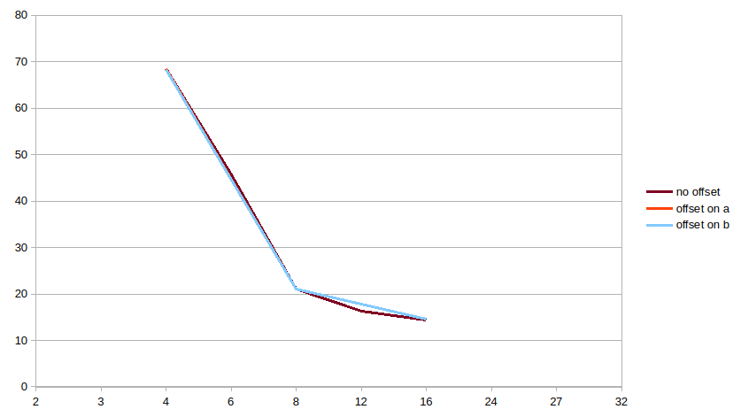

DGPU: AMD Radeon 5700 XT

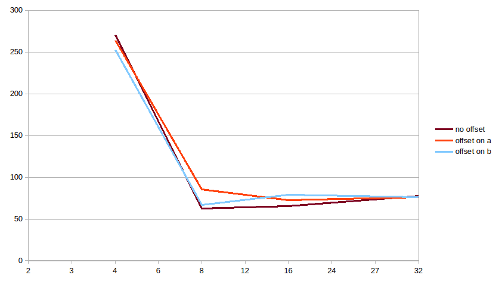

DGPU: NVIDIA GeForce RTX 3050 Mobile

Можно заметить, что в большинстве случаев реализация без расширений самая быстрая, но есть TILE_SIZE на которых это дает выигрыш в скорости. Это обусловлено тем, что в данной реализации без сдвигов банк конфликтов изначально было 0 процентов, поэтому сдвиги не делали лучше

## Реализация 3
Тут также использовали локальную память и также векторные float типы данных, которые поддерживают векторные операции. Таким образом количество доступов в память было уменьшено в WI_WORK раз(размерность вектор в кернеле).

Были произведены замеры для всех устройств в различных сочетания TILE SIZE и WI_WORK 
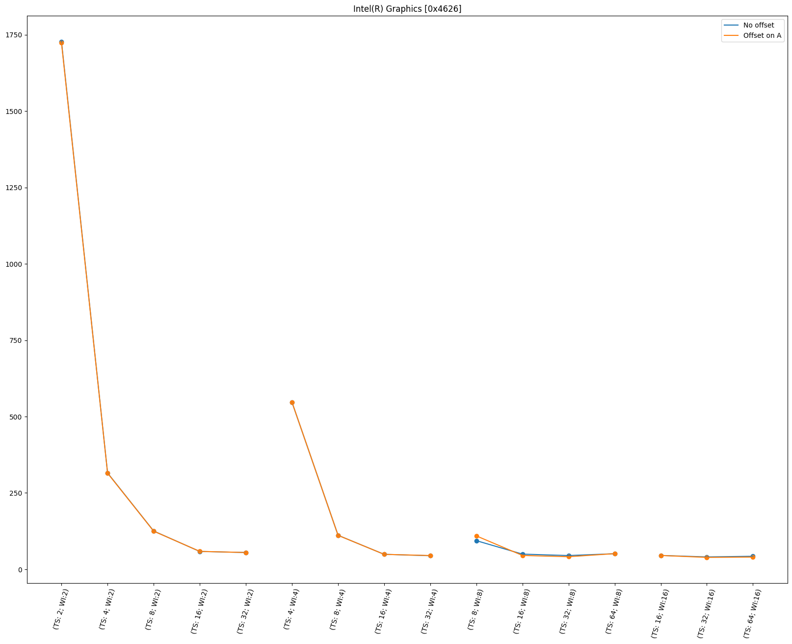

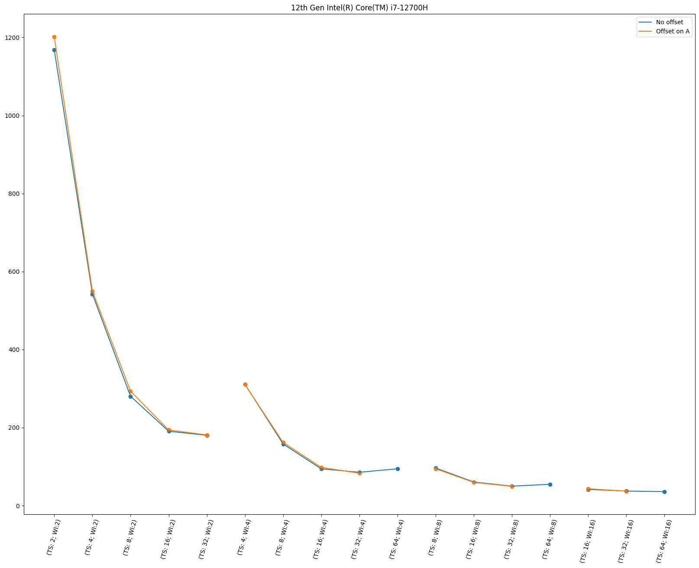

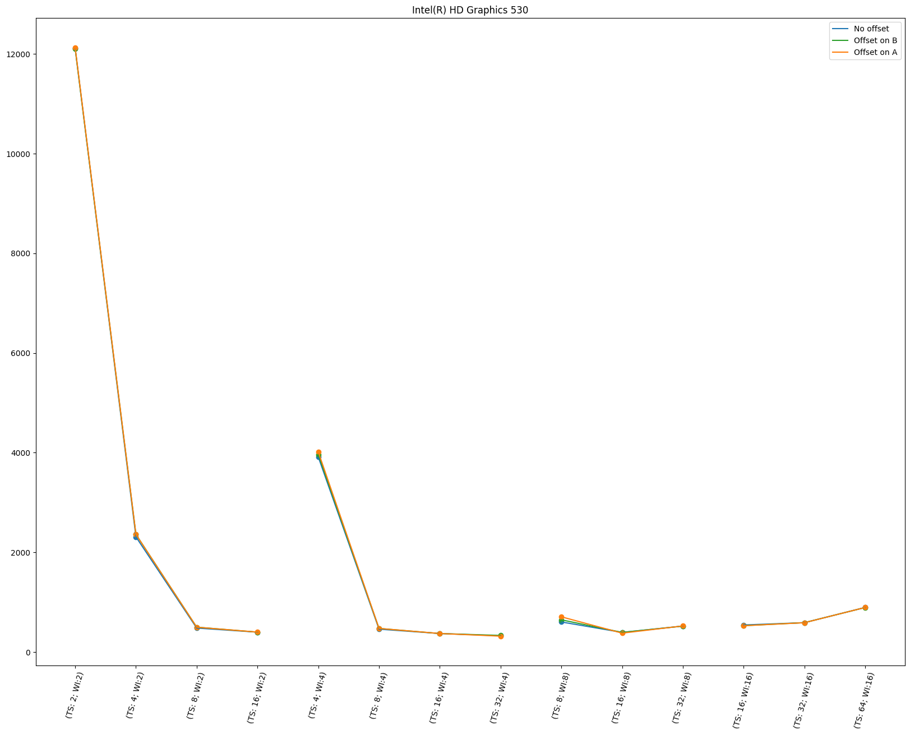
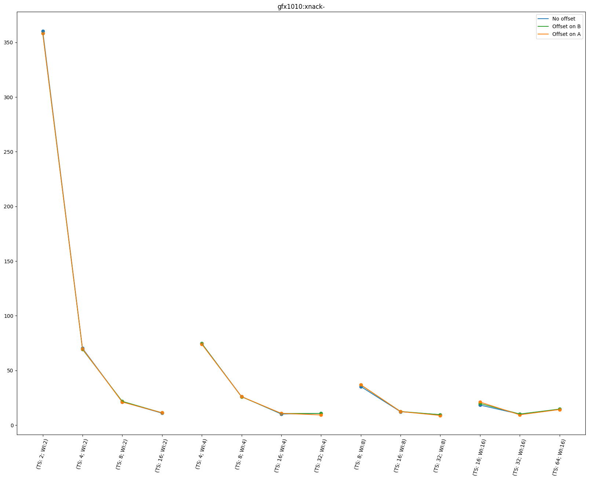
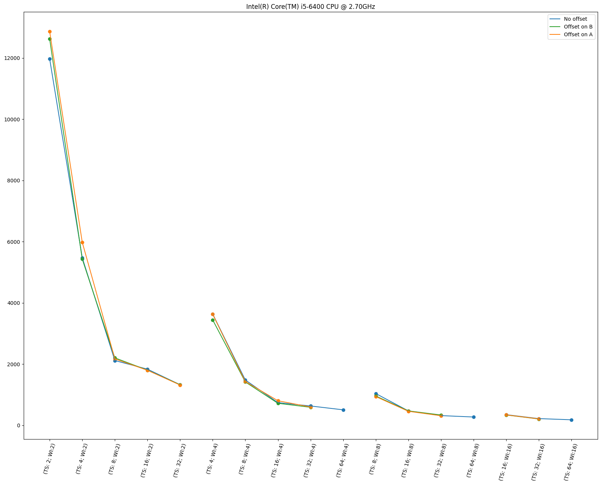
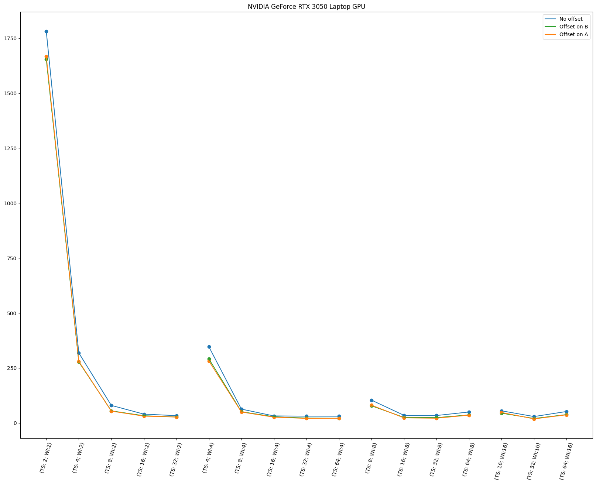

Тут также можно заметить, прямую зависимость скорости от TILE_SIZE, также при одних и тех размерах TILE_SIZE при увеличении WI_WORK(вплоть до 8) увеличивается скорость.

В этой реализации расширение локальной памяти (особенно для матрицы A) может улучшить результат. Удалось подобрать параметры так, чтобы количество банк-конфликтов упало с 25% до 5% и получить ускорение

## Замеры скорости
Были выполнены с помощью bash-скрипта, запускались на всех доступных устройствах, замерялось при n=m=k=2048

## Итоговые результаты
При тестировании были получены результаты
| Номер реализации | время работы без учета передачи данных | Полное время работы | TILE_SIZE | WI_WORK |
|------------------|----------------------------------------|---------------------|-----------|---------|
| 0                | 61413.9                                | -             | -         | -       |
| 1                | 66.6993                                | 86.7814             | -         | -       |
| 2                | 14.2932                                | 23.4153             | [16, 16]  | -       |
| 3                | 8.79684                                | 18.1667             | [4, 32]   | 8       |
